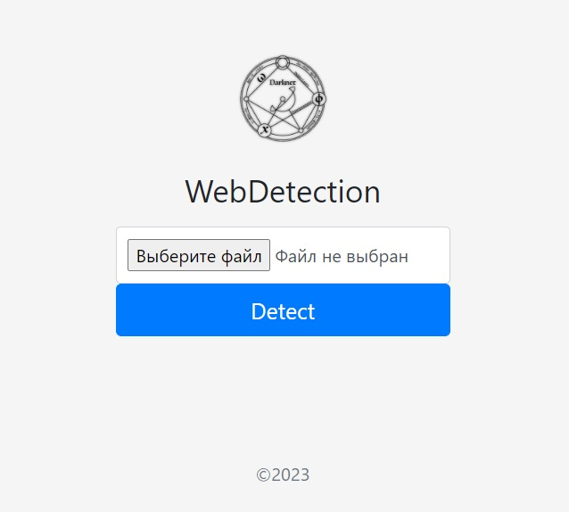
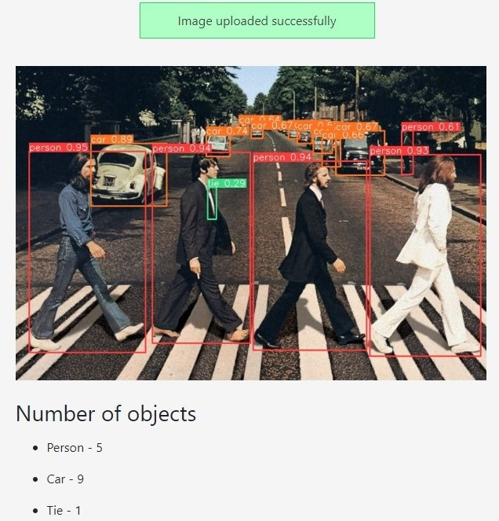

<a href="https://github.com/denisliv"></a> 
<a href="https://github.com/denisliv/WebDetection/graphs/commit-activity"> </a>


# Yolov8 object detection model deployment using flask
This repo contains example app for exposing the [YOLOv8](https://github.com/ultralytics/ultralytics) object detection model via a [flask](https://flask.palletsprojects.com/en/2.2.x/).
## WebDetection
Simple app consisting of a form where you can upload an image, and see the inference result of the model in the browser.

<p align="center">

</p>

<p align="center">

</p>

Processed images are saved in the `static/results` directory with the original filename.

## Installation
### Clone repository and install requirements

```
git clone git@github.com:denisliv/WebDetection.git
cd WebDetection
pip install -r requirements.txt
```

## Usage
### Start the application

```$ python3 server.py --port 5000```

then visit [http://localhost:5000/](http://localhost:5000/) in your browser:

## Contacts:

[](https://www.linkedin.com/in/denis-iv/)
